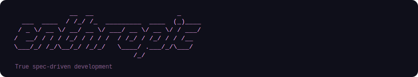

  

  
  &nbsp;
  

---

A `.enth` file is the architectural contract of your project. You write it once. Every AI session reads it before writing a single line of code. Same spec, two machines, two agents: architecturally identical output.

Natural language is inherently ambiguous — the same words mean different things across models, sessions, and prompts. A `.enth` file has a grammar, a parser, and a validator. It cannot be misread.

  
  &nbsp;&nbsp;
  

## Why

Vibe coding generates entropy. The AI fills every undeclared decision arbitrarily — naming, layers, security — differently every session. Enthropic collapses that space upfront.

The root cause of AI inconsistency is not the model. It's the missing source of truth.

## Examples

Annotated `.enth` files covering different domains and complexity levels: [examples/](examples/)

---

This project is in early development. The format already works, but there is meaningful work left on semantic precision and completeness. Criticism and contributions are very welcome — read [CONTRIBUTING.md](CONTRIBUTING.md) to get involved.
